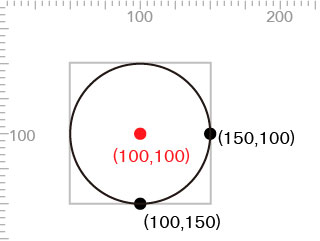

# motion-design
### Introduction 
These works utilize [anime.js](http://anime-js.com) open source javascript library to construct transition animation design.  
There will be 8 examples below to illustrate differnent ways of utilizing the library.

Remember to put anime.js into the same directory and include below line into html script.  
```javascript
<script src="anime.js"></script>
```
The view area is set to 1920x1080 where the animations take space.
```html
<svg class="frame" viewBox="0 0 1920 1080">
  ...
</svg>
```

### Transform Object


```html
<g fill="#FFFFFF">
  <circle cx="-350" cy="540" r="100"/>
</g>
```
```javascript
<script>
  var moveAnimation = anime({
  targets: 'g',
  translateX: 350 + (1920/2), 
  /* 350 = start position 
  1920/2 = half the horzirontal viewing area */
  delay: 1000,
  duration: 1366,
  easing: 'easeInOutCirc',
  });
  moveAnimation.play();
</script>
```

##### Circle
If you create a circle, the anchor point is in the middle.


##### Rectangle
If you create a rectangle, the anchor point is in the upper-left corner.


##### SVG graphic
If you want to replace the item with a SVG object, please follow below steps.  
1. Create a illustrator file with size 200px * 200px. If you want to use other size, the parameter in animation function must be modified as well.  
2. ...


### Scale Object

```html
<g fill="#FFFFFF">
  <circle cx="960" cy="540" r="1"/>
</g>
```
```javascript
<script>
  var scaleAnimation = anime({
    targets: 'g',
    transform: ['translate(0 0) scale(1)', 'translate(-95040 -53460) scale(100)'],
    /* scale 100 times mean cx'=96000 cy'=54000 r'=100
    To be able to compensate the poisition change, translate is required
    960 = 96000-95040, 540 = 54000 - 53460
    */
    delay: 1000,
    duration: 1366,
    autoplay: false,
    easing: 'easeInOutQuart',
  });
  scaleAnimation.play();
</script>
```

### Scale Object with compensation


            <g fill="#FFFFFF">
                <rect x="960" y="540" width="2" height="2"/>
            </g>
                    var scaleAnimation = anime({
            targets: 'rect',
            transform: ['translate(0 0) scale(1 1)', 'translate(-95140 -53660) scale(100 100)'], 
            /* scale 100 times mean x'=96000 y'=54000
            To be able to compensate the poisition change, translate is required
            860 = 96000-95140, 340 = 54000 - 53660
            */
            
            delay: 1000,
            duration: 733,
            autoplay: false,
            easing: 'easeInOutQuart',
        });
      
      
      scaleAnimation.play();

### Scale Object with compensation in two steps


            <g fill="#FB652F">
                <rect x="960" y="540" width="5" height="5"/>
            </g>

  <script>

      /* The animation took steps, horizontal expan then vertical expand
      In second animation, the transform parameter in X axis should be kept to maintain the rectangle shape */
        var horizonAnimation = anime({
            targets: 'rect',
            transform: ['translate(0 0) scale(1 1)', 'translate(-95290 1) scale(100 1)'],
            /* scale 100 times mean x'=96000
            To be able to compensate the poisition change, translate is required
            960 - 250 = 710 = 96000-95290
            */
            
            /* when animation start fill rectangle with white color*/
            fill: ['#FFFFFF'],
            delay: 1000,
            duration: 200,
            autoplay: false,
            easing: 'easeInOutQuart',
        });
      
      var veritcalOpenAnimation = anime({
            targets: 'rect',
            transform: ['translate(-95290 1) scale(100 1)', 'translate(-95290 -53960) scale(100 100)'],
            /* scale 100 times mean y'=54000
            To be able to compensate the poisition change, translate is required
            540 - 500 = 40 = 54000 - 53960
            */
          
            
            duration: 533,
            autoplay: false,
            easing: 'easeInOutQuart',
        });
      
      /*when unit horizontal expand finish, then expand verically*/
      horizonAnimation.settings.complete = function(){
          veritcalOpenAnimation.restart();
      }      
      horizonAnimation.play();
  </script>

### Method to Delay Animation


           <g fill="#FFFFFF">

                <circle cx="960" cy="540" r="100"/>
            </g>
            
              <script>
        var pressAnimation1 = anime({
            targets: 'circle',
            transform: ['translate(0 0) scale(1 1)', 'translate(28.8 16.2) scale(0.97 0.97)'],
            /* scale point from 100% to 97% means cx'=931.2 cy'=523,8  
            The position need to be commensated 
            960 - 931.2 = 28.8, 540 - 0.97 = 16.2 
            */
            
            delay: 2000,
            
            /*After scale to 97%, this fill animation will make circel delay 2sec then expand back to 100% */
            fill:{
                value:['#FFFFFF','#FFFFFF'],
                delay: 2000,
                duration: 967,
            },
            duration: 67,
            autoplay: false,
            
            /* alternate means the animation works both ways from 100% to 97% then 97% to 100% 
            and fill action will make 2 second delay in between*/
            direction: 'alternate',
            easing: 'easeInOutCubic',
      });

      pressAnimation1.play();
      

  </script>

### Transform Window


            <g fill="#F2A91A">
                <rect x="0" y="0" width="1920" height="1080"/>
            </g>
            
              <script>
    var swipeAnimation = anime({
      targets: 'rect',
      
    /* swipe all the way out the viewing area */
      translateX: 1920,
      duration: 800,
      autoplay:false,
      easing: 'easeInOutQuint',
    }); 
    swipeAnimation.play();
      
  </script>

### Transform Window in two steps


        <svg class="frame" viewBox="0 0 1920 1080">
            
            <!--Two lines in the middle of viewing area with 0.1 thickness -->  
            <rect id="yellow" x="0" y="540" width="1920" height="0.1" fill="#F2A91A"/>
            <rect id="orange"x="0" y="540" width="1920" height="0.1" fill="#FB652F"/>
            
            
        </svg>
        
         <script>

      
        var closeAnimation = anime({
            targets: 'rect#yellow', /*yellow line is the target*/
            transform: ['translate(0 0) scale(1 1)', 'translate(0 -5832000) scale(1 10800)'],
            /* The yellow line is 1920*0.01 at positon (0, 540) */
            /* Transform to 1920*1080 at position (0,0)*/
            delay: 1000,
            duration: 117,
            direction: 'reverse',  /* Reverse the transform function which means the yellow line will close from 1920*1080 to 1920*0.01 */
            autoplay: false,
            easing: 'easeInQuart',
        });
    
      var openAnimation = anime({
            targets: 'rect#orange', /*orange line is the target*/
            transform: ['translate(0 0) scale(1 1)', 'translate(0 -5832000) scale(1 10800)'], 
            /* The oragne line is 1920*0.01 at positon (0, 540) */
            /* Transform to 1920*1080 at position (0,0)*/         
            duration: 217,
            autoplay: false,
            easing: 'easeOutQuart',
        });
      
      /*Set the timing that once yellow line rectangle close, the organe will then expand. */
      closeAnimation.settings.complete = function(){
          openAnimation.restart();
      } 
      closeAnimation.play();
  </script>
